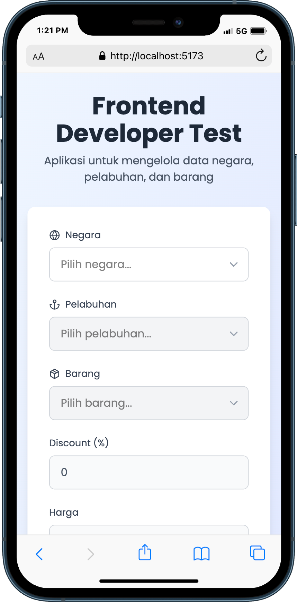

# Frontend Developer Test

Aplikasi React untuk mengelola data negara, pelabuhan, dan barang dengan fitur auto-complete dan perhitungan otomatis.

## 🖼️ Screenshot

  
_Form utama dengan auto-complete negara, pelabuhan, dan barang_

## 🚀 Fitur

- **Auto-complete Negara**: Memuat data negara dari API
- **Auto-complete Pelabuhan**: Memuat data pelabuhan berdasarkan negara yang dipilih
- **Auto-complete Barang**: Memuat data barang berdasarkan pelabuhan yang dipilih
- **Perhitungan Otomatis**: Total dihitung otomatis berdasarkan harga dan diskon
- **UI/UX Modern**: Desain yang responsif dan menarik dengan Tailwind CSS
- **TypeScript**: Type safety untuk pengembangan yang lebih baik
- **Error Handling**: Penanganan error yang komprehensif

## 🛠️ Teknologi yang Digunakan

- **React 19** - Library JavaScript untuk membangun UI
- **Vite** - Build tool yang cepat untuk development
- **TypeScript** - Superset JavaScript dengan type safety
- **Tailwind CSS** - Framework CSS untuk styling
- **Axios** - HTTP client untuk API calls
- **Lucide React** - Icon library

## 📋 Persyaratan

- Node.js (versi 18 atau lebih baru)
- pnpm, npm atau yarn

## 🚀 Instalasi

1. Clone repository ini:

```bash
git clone https://github.com/muelava/frontend-muhammad-elang-hardifal.git
cd frontend-muhammad-elang-hardifal
```

2. Install dependencies:

```bash
# pnpm
pnpm install
#npm
npm install
# atau
yarn install
```

3. Jalankan development server:

```bash
#pnpm
pnpm dev
#npm
npm run dev
# atau
yarn dev
```

4. Buka browser dan akses `http://localhost:5173`

## 📁 Struktur Project

```
src/
├── components/
│   ├── Header/
│   │   └── index.tsx          # Komponen Header
│   ├── Footer/
│   │   └── index.tsx          # Komponen Footer
│   ├── FormCard/
│   │   └── index.tsx          # Komponen Form Card
│   ├── AutoComplete/
│   └── index.tsx       # Komponen auto-complete reusable
├── services/
│   ├── api.ts                 # Konfigurasi Axios dengan interceptor
│   └── apiService.ts          # Service untuk API calls
├── types/
│   └── index.ts               # TypeScript type definitions
├── App.tsx                    # Komponen utama aplikasi
└── main.tsx                   # Entry point aplikasi
```

## 🔧 Konfigurasi API

API endpoints yang digunakan:

- **Negara**: `http://202.157.176.100:3001/negaras`
- **Pelabuhan**: `http://202.157.176.100:3001/pelabuhans?filter={"where":{"id_negara":1}}`
- **Barang**: `http://202.157.176.100:3001/barangs?filter={"where":{"id_pelabuhan":11}}`

## 🎯 Cara Penggunaan

1. **Pilih Negara**: Klik pada field "Negara" dan pilih negara dari dropdown
2. **Pilih Pelabuhan**: Setelah negara dipilih, pilih pelabuhan yang tersedia
3. **Pilih Barang**: Setelah pelabuhan dipilih, pilih barang yang tersedia
4. **Lihat Hasil**: Deskripsi, diskon, harga, dan total akan terisi otomatis

## 🎨 Fitur UI/UX

- **Responsive Design**: Tampilan yang optimal di berbagai ukuran layar
- **Loading States**: Indikator loading saat memuat data
- **Auto-complete**: Pencarian dan filter data secara real-time
- **Form Validation**: Validasi input dan dependency antar field
- **Error Handling**: Notifikasi error yang user-friendly
- **Modern Icons**: Menggunakan Lucide React untuk ikon yang modern

## 📊 Perhitungan

Total dihitung dengan rumus:

```
Total = Harga × (Diskon / 100)
```

Format mata uang menggunakan format Indonesia (IDR) dengan pemisah ribuan.

## 🔒 Error Handling

Aplikasi mencakup:

- Timeout handling untuk request yang lama
- Error interceptor untuk menangani berbagai jenis error
- Fallback UI untuk state error
- Logging untuk debugging

## 📱 Build untuk Production

```bash
#pnpm
pnpm build
#npm
npm run build
# atau
yarn build
```

File build akan tersedia di folder `dist/`.

## 📄 License

This project is licensed under the MIT License.

## 👤 Author

**Muhammad Elang Hardifal**

- GitHub: [@muelava](https://github.com/muelava)
- Email: muelava@gmail.com

---

_Dibuat sebagai bagian dari Frontend Developer Test untuk PT. Amar Mulia Bersama_
